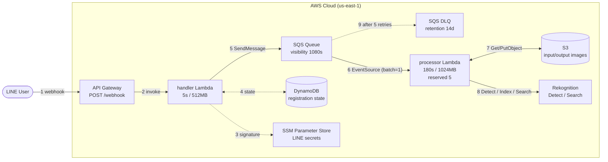

# mosaic-app

LINE で送った写真の顔を自動でモザイク処理するサーバーレスアプリケーション。あらかじめ登録した顔だけはモザイクから除外する。

LINE webhook 受信から画像処理を SQS で分離した非同期構成。LINE 側に求められる「2 秒以内に 200 を返す」を確実に守りつつ、画像処理は時間制約なしで動く。

## アーキテクチャ



詳細図は `docs/architecture.drawio`（draw.io で開く）。

### データフロー

1. LINE User が写真を送ると LINE Platform から webhook が API Gateway に POST される
2. API Gateway が handler Lambda を起動する
3. handler Lambda が SSM Parameter Store から LINE Channel Secret を取り出して `X-Line-Signature` を検証する
4. handler Lambda が DynamoDB を `userId` で読み書きして登録モード状態を判定する
5. handler Lambda が SQS にメッセージを投入して即座に 200 を返す
6. SQS の EventSourceMapping が processor Lambda を起動する（`reserved_concurrent_executions=5`）
7. processor Lambda が LINE Content API で原画像を取得して S3 に保存し、結果画像も S3 に書き戻す
8. processor Lambda が Rekognition で顔検出と照合を行い、登録済み以外をモザイク化する
9. 5 回リトライしても失敗したメッセージは DLQ に退避する（保管期限 14 日）

handler / processor の LINE 返信はそれぞれ Reply API / Push API を使う。CloudWatch Logs は両 Lambda の標準出力を自動収集する。

## 使い方

### 友達追加

LINE で公式アカウントを友達追加すると利用開始。

### 写真を送る

写真を送信すると数十秒以内に処理結果が返ってくる。デフォルト動作は「登録した顔以外をモザイク化」。

### コマンド

| メッセージ | 動作 |
|---|---|
| `登録` | 次に送られた写真の顔を Rekognition コレクションに登録（モザイク除外対象になる）|
| `状態` | 現在のモード設定と登録済み顔数を返信 |

### 顔登録の流れ

1. `登録` とテキスト送信
2. 1 人だけが写った顔写真を送信
3. 登録完了後、以降の写真ではその人の顔だけモザイクが外れる

### 注意事項

- 顔登録は 1 枚に 1 人のみ。複数人が写った写真は登録できない
- 1 枚に 20 人以下の顔なら個別照合、21 人以上は性能保護のため全員モザイクになる
- 類似度 50% 以上で「登録済み顔」と判定する。横顔・暗所・小さく写ると照合に失敗してモザイクがかかる
- 複数人を登録した場合は登録者全員がモザイク除外対象になる（優先順位や 1 人だけ除外といった扱いはしない）

## 技術スタック

- 言語: Python 3.12
- 主要ライブラリ: Pillow（モザイク処理）, boto3（AWS SDK）, requests（LINE API）
- インフラ: AWS Lambda（Container Image）, API Gateway REST, SQS, DynamoDB, S3, Rekognition, SSM Parameter Store
- IaC: AWS CDK v2 (Python)
- リージョン: us-east-1

## ディレクトリ構造

```
mosaic-app/
├── cdk/                     # CDK プロジェクト
│   ├── app.py
│   ├── stacks/mosaic_stack.py
│   ├── cdk.json
│   └── requirements.txt
├── handler/                 # 受信用 Lambda
│   ├── Dockerfile
│   ├── app.py
│   └── requirements.txt
├── processor/               # 画像処理用 Lambda
│   ├── Dockerfile
│   ├── app.py
│   ├── image_handler.py     # モザイク処理ロジック
│   ├── mosaic_processor.py
│   ├── face_cropper.py
│   ├── face_matcher.py
│   ├── collection_manager.py
│   └── requirements.txt
├── shared/                  # handler/processor 共通コード
│   ├── line_signature.py
│   └── line_api.py
├── tests/                   # pytest（cdk/handler/processor/shared 配下にミラー）
├── scripts/                 # デプロイ・初期化スクリプト
│   ├── deploy.sh
│   └── setup-secrets.sh
├── docs/                    # plan/spec/todo/knowledge と構成図
└── .github/workflows/       # CI/CD（GitHub Actions）
```

## 前提条件

ローカル環境に必要なもの:

- Python 3.12
- Docker（CDK が `DockerImageAsset` をビルドするため必須）
- AWS CDK CLI v2 (`npm i -g aws-cdk` または `pipx install aws-cdk`)
- AWS CLI（認証済み、`us-east-1` をデフォルトに）

LINE 側に必要なもの:

- LINE Developers でチャネル作成
- Channel Access Token（長期）と Channel Secret を発行

## 初回セットアップ

### 1. シークレットを `~/.secrets/mosaic-app.env` に保存

リポジトリの外に置くこと。

```bash
# ~/.secrets/mosaic-app.env
S3_BUCKET_NAME=<画像保存用 S3 バケット名>
REKOGNITION_COLLECTION_ID=<Rekognition コレクション ID>
LINE_CHANNEL_SECRET=<LINE Developers から>
LINE_CHANNEL_ACCESS_TOKEN=<LINE Developers から>
LINE_CHANNEL_SECRET_PARAM=/mosaic-app/line/channel-secret
LINE_CHANNEL_ACCESS_TOKEN_PARAM=/mosaic-app/line/channel-access-token
```

### 2. 既存リソース（S3 バケット・Rekognition コレクション）を作成

CDK では作成しない。状態を持つリソースなので手動管理する。

```bash
aws s3 mb s3://<bucket-name> --region us-east-1
aws rekognition create-collection \
  --collection-id <collection-id> \
  --region us-east-1
```

### 3. SSM Parameter Store に LINE シークレットを投入

```bash
./scripts/setup-secrets.sh
```

LINE トークン 2 本を SecureString として SSM に書き込む。値の更新時にも同じスクリプトを使う。

### 4. Python 仮想環境と CDK 依存

```bash
python3 -m venv .venv
source .venv/bin/activate
pip install -r cdk/requirements.txt -r requirements-dev.txt
```

### 5. CDK Bootstrap（同アカウント・同リージョンで未実施なら）

```bash
cd cdk && cdk bootstrap aws://<account-id>/us-east-1
```

### 6. 初回デプロイ

```bash
./scripts/deploy.sh
```

`scripts/deploy.sh` は `~/.secrets/mosaic-app.env` を読み、必要な context を渡して `cdk deploy` を呼ぶ。

### 7. LINE Webhook URL の登録

`cdk deploy` の Outputs に出る API Gateway の URL（`https://<api-id>.execute-api.us-east-1.amazonaws.com/prod/webhook`）を LINE Developers の Webhook URL に設定する。

## 更新デプロイ

コード変更後の再デプロイは `scripts/deploy.sh` を再実行するだけ。CDK の `DockerImageAsset` がコンテンツハッシュで差分を検知し、変更があれば自動で ECR に push して Lambda を更新する。

```bash
./scripts/deploy.sh
```

## テスト

```bash
source .venv/bin/activate
python -m pytest tests/ -v
```

カテゴリ別:

```bash
python -m pytest tests/handler/    # handler Lambda の単体テスト
python -m pytest tests/processor/  # processor Lambda の単体テスト
python -m pytest tests/shared/     # 共通モジュール
python -m pytest tests/cdk/        # CDK スナップショットテスト
```

## 環境変数 / context

CDK スタックに渡す context（`scripts/deploy.sh` で自動セット）:

| context キー | 用途 |
|---|---|
| `s3_bucket_name` | 画像保存用 S3 バケット名 |
| `rekognition_collection_id` | Rekognition コレクション ID |
| `line_channel_secret_param` | SSM Parameter Store のパラメータ名（Channel Secret 用）|
| `line_channel_access_token_param` | 同上（Channel Access Token 用）|

Lambda 実行時に環境変数として渡される値:

| 変数名 | 設定先 | 説明 |
|---|---|---|
| `SQS_QUEUE_URL` | handler | エンキュー先キュー URL |
| `REGISTRATION_TABLE_NAME` | handler | DynamoDB テーブル名 |
| `REKOGNITION_COLLECTION_ID` | handler / processor | コレクション ID |
| `LINE_CHANNEL_SECRET_PARAM` | handler | SSM パラメータ名 |
| `LINE_CHANNEL_ACCESS_TOKEN_PARAM` | handler / processor | SSM パラメータ名 |
| `S3_BUCKET_NAME` | processor | 画像保存先バケット名 |
| `MOSAIC_MODE` | processor | `exclude`（登録外モザイク）/ `all`（全員モザイク）|

## 主要な設定値（コード内ハードコード）

| 値 | 場所 | 既定 |
|---|---|---|
| 顔数上限（個別照合 / 全員モザイク切替）| `processor/image_handler.py` | 20 人 |
| Rekognition 類似度閾値 | `processor/image_handler.py` | 50.0 % |
| モザイク粒度 | `processor/mosaic_processor.py` | 20 |
| handler Lambda timeout | `cdk/stacks/mosaic_stack.py` | 5 秒 |
| processor Lambda timeout | `cdk/stacks/mosaic_stack.py` | 180 秒 |
| SQS visibility timeout | `cdk/stacks/mosaic_stack.py` | 1080 秒（関数 timeout の 6 倍）|
| DLQ maxReceiveCount | `cdk/stacks/mosaic_stack.py` | 5 |
| processor 同時実行数 | `cdk/stacks/mosaic_stack.py` | 5（reserved）|

## ドキュメント

- `docs/plan.md` — 設計の背景と技術選定の理由
- `docs/spec.md` — Lambda 仕様・IAM 最小権限・テスト戦略
- `docs/todo.md` — 実装タスクの進捗
- `docs/knowledge.md` — 開発中に得た知見・ハマりどころ
- `docs/architecture.drawio` — 構成図（draw.io 形式）
